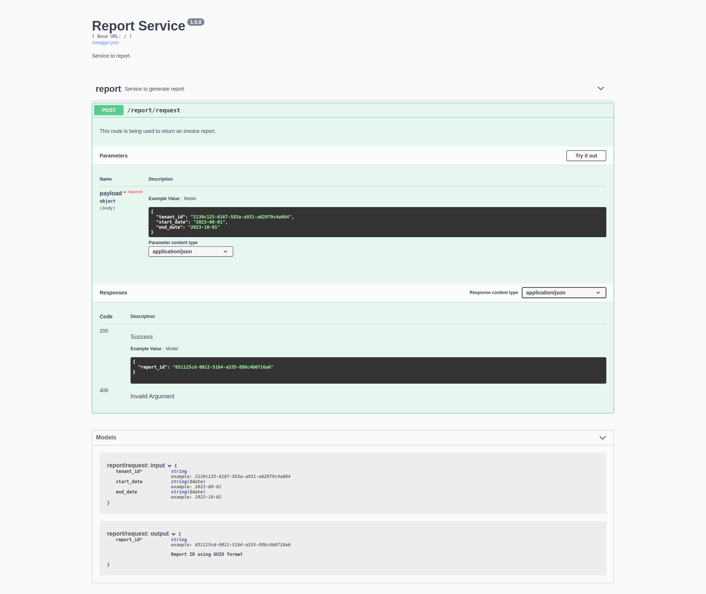

Using Celery with Flask
=======================

 
 

This repository contains an example of an API using Flask and Celery for asynchronous processing.

Quick Setup
-----------

1. Clone this repository.
2. Create a virtualenv and install the requirements.
3. Open a second terminal window and start a local Redis server (if you are on Linux or Mac, execute `run-redis.sh` to install and launch a private copy).
4. Open a third terminal window. Set environment variables to:
    - environment (local | prod):
        - `ENV`
    - connect Mongo account credentials:
        - `PREFIX_DB_MONGO`
        - `USER_DB_MONGO`
        - `PW_DB_MONGO`
        - `HOST_DB_MONGO`
        - `COMPLEMENT_DB_MONGO`
    - connect Redshift account credentials:
        - `HOST_DB_REDSHIFT`
        - `DATABASE_DB_REDSHIFT`
        - `PORT_DB_REDSHIFT`
        - `USER_DB_REDSHIFT`
        - `PW_DB_REDSHIFT`
    - broker url:
        - `CELERY_BROKER_URL`
    - connect S3 account credentials:
        - `S3_ACCESS_KEY`
        - `S3_SECRET_KEY`
        - `S3_BUCKET`
    - S3 path to save punctuation reports:
        - `S3_REPORT_FILE_PATH`
5. Then start a Celery worker: `venv/bin/celery -A celery_worker.celery worker --loglevel=info --without-gossip --without-mingle --without-heartbeat --pool=prefork --task-events --prefetch-multiplier=1 --max-tasks-per-child=1 --time-limit=125`.
6. Start the Flask application on your original terminal window: `venv/bin/python main.py`.
7. Go to `http://localhost:8000/` and enjoy this application!

Preview
-----------

